  # FINAL FANTASY - INSERT VMJ
  
  

  
  

El juego Final Fantasy - Insert VMJ es un juego de lucha PvE en donde personajes místicos y fantasiosos batallan por la gloria. Los niveles con los que el juego se desbloquean a medida que los vamos ganando, estos cuentan con una dificultad mayor mientras se avanzan entre los distintos escenarios, donde se van descubriendo nuevos ataques con mas potencia y enemigos con mas agresividad.

### Equipo de estudiantes de la UTN FRBA 
<li>Garro, Agustina Mercedes</li>
<li>Ramos, Milagros</li>
<li>Rau Robayo, Valentina Luján</li>
<li>Recalde, Martina Del Rosario</li>
<li>Antonio, Tomás Julián</li>
<li>Waibschnaider, Julian Ioel</li>

***

## Instrucciones

<li><b>X</b> Para seleccionar</li>
<li><b>Z</b> Para poner pausa durante una batalla</li>
<li>↑ ↓ ← → Para moverse en los menúes</li>
<li><b>R</b> Para reiniciar una vez finalizada la batalla final</li>

## Personajes

<table>
 <tr>
    <th>Personaje</th>
    <th>Foto</th>
    <th>Vida</th>
    <th>Fuerza</th>
   <th>Vigor</th>
   <th>Intelecto</th>
   <th>Mente</th>
  </tr>
  <tr>
    <td><b>Clerigo</b></td>
    <td>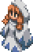</td>
    <td>120</td>
    <td>20</td>
    <td>30</td>
    <td>70</td>
    <td>70</td>
  </tr>
  <tr>
    <td><b>Ladron</b></td>
    <td></td>
    <td>100</td>
    <td>70</td>
    <td>70</td>
    <td>25</td>
    <td>30</td>
  </tr>
  <tr>
    <td><b>Poseidon</b></td>
    <td>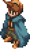</td>
    <td>150</td>
    <td>40</td>
    <td>20</td>
    <td>60</td>
    <td>10</td>
  </tr>
  <tr>
    <td><b>Hercules</b></td>
    <td>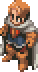</td>
    <td>120</td>
    <td>90</td>
    <td>50</td>
    <td>40</td>
    <td>70</td>
  </tr>
</table>

  

## Enemigos 
<table>
 <tr>
    <th>Personaje</th>
    <th>Foto</th>
    <th>Vida</th>
    <th>Fuerza</th>
   <th>Vigor</th>
   <th>Intelecto</th>
   <th>Mente</th>
  </tr>
  <tr>
    <td><b>Cactrot</b></td>
    <td>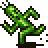</td>
    <td>100</td>
    <td>50</td>
    <td>15</td>
    <td>20</td>
    <td>15</td>
  </tr>
  <tr>
    <td><b>Flan</b></td>
    <td>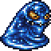</td>
    <td>150</td>
    <td>50</td>
    <td>40</td>
    <td>30</td>
    <td>40</td>
  </tr>
  <tr>
    <td><b>Tomberi</b></td>
    <td>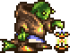</td>
    <td>200</td>
    <td>50</td>
    <td>40</td>
    <td>30</td>
    <td>40</td>
  </tr>
  <tr>
    <td><b>Duende</b></td>
    <td>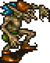</td>
    <td>170</td>
    <td>50</td>
    <td>50</td>
    <td>60</td>
    <td>35</td>
  </tr>
   <tr>
    <td><b>Pterodon</b></td>
    <td>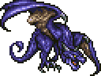</td>
    <td>500</td>
    <td>100</td>
    <td>15</td>
    <td>20</td>
    <td>15</td>
  </tr>
   <tr>
    <td><b>Shiva</b></td>
    <td></td>
    <td>500</td>
    <td>50</td>
    <td>15</td>
    <td>100</td>
    <td>15</td>
  </tr>
  <tr>
    <td><b>Mago Supremo</b></td>
    <td>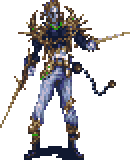</td>
    <td>1000</td>
    <td>100</td>
    <td>15</td>
    <td>100</td>
    <td>15</td>
  </tr>
</table>

## Batallas

  <h4>Mapa inicial del Juego.</h4>
  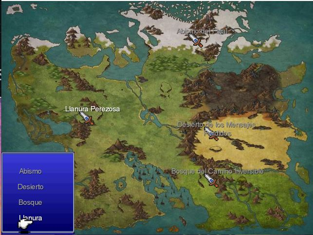
  <h4>Batalla en Llanura Perezosa (Dificultad = Fácil).</h4>
  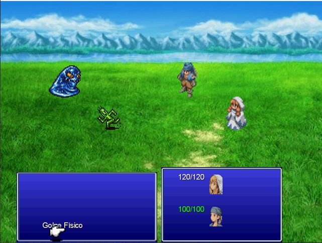
  <h4>Una vez ganada la batalla en Llanura Perezosa desbloqueamos la segunda batalla.</h4>
  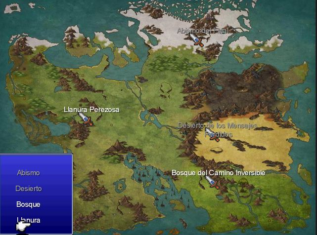
  <h4>Batalla en el Bosque del Camino Inversible (Dificultad = Dificil). </h4>
  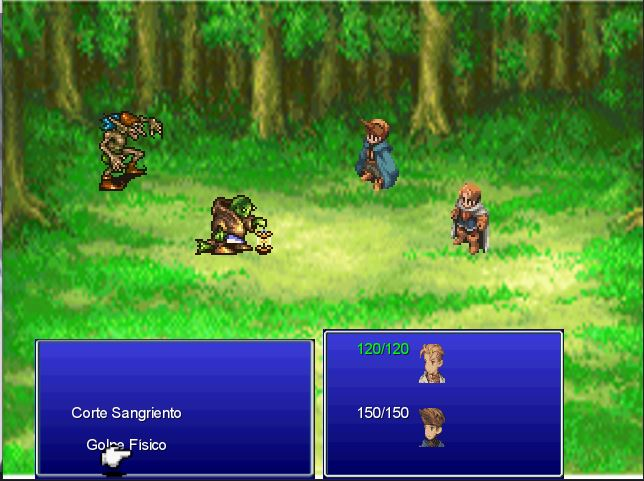
  <h4>Si ganamos en el bosque, obtenemos la tercera batalla.</h4>
  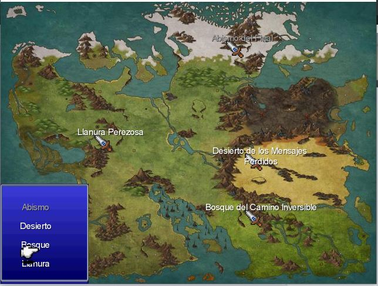
  <h4>Batalla en el Desierto de los Mensajes Perdidos (Dificultad = Legendario). </h4>
  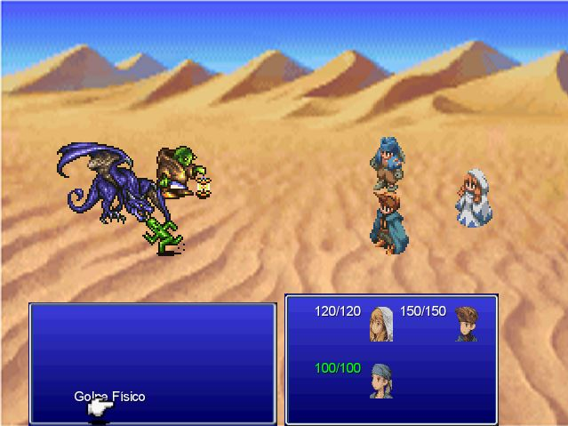
  <h4>Si sobrevivimos al desierto, la batalla final nos espera.</h4>
  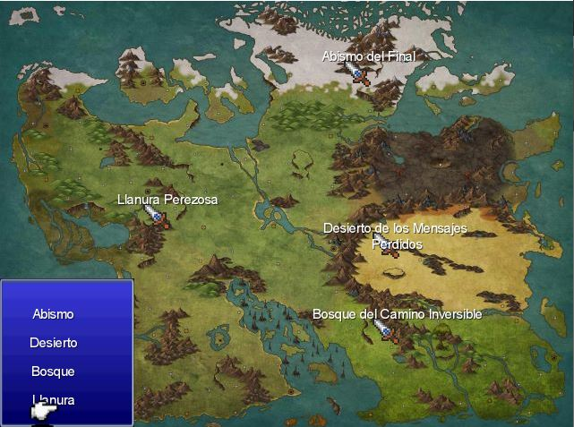
  <h4>Batalla en el abismo del final (Dificultad = Sensei). </h4>
  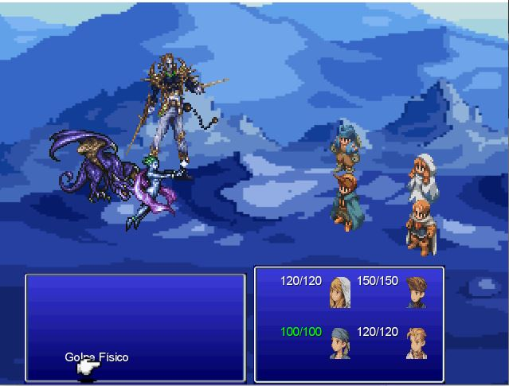

  
  

