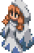
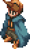
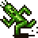
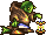

  # FINAL FANTASY - INSERT VMJ
  
  

  
  

El juego Final Fantasy - Insert VMJ es un juego de lucha PvE en donde personajes misticos y fantasiosos batallan por la gloria. Los niveles con los que el juego cuenta tienen una dificultad mayor a medida que se avanzan entre los distintos escenario, donde se van descubriendo nuevos ataques con mas potencia y enemigos con mas agresividad.     
 ***
## Personajes

<table>
 <tr>
    <th>Personaje</th>
    <th>Foto</th>
    <th>Vida</th>
    <th>Fuerza</th>
   <th>Vigor</th>
   <th>Intelecto</th>
   <th>Mente</th>
  </tr>
  <tr>
    <td><b>Clerigo</b></td>
    <td></td>
    <td>120</td>
    <td>20</td>
    <td>30</td>
    <td>70</td>
    <td>70</td>
  </tr>
  <tr>
    <td><b>Ladron</b></td>
    <td></td>
    <td>100</td>
    <td>70</td>
    <td>70</td>
    <td>25</td>
    <td>30</td>
  </tr>
  <tr>
    <td><b>Poseidon</b></td>
    <td></td>
    <td>150</td>
    <td>40</td>
    <td>20</td>
    <td>60</td>
    <td>10</td>
  </tr>
  <tr>
    <td><b>Hercules</b></td>
    <td></td>
    <td>120</td>
    <td>90</td>
    <td>50</td>
    <td>40</td>
    <td>70</td>
  </tr>
</table 

  
 ## Enemigos 

### Cactroc 
* Vida = 100
*	Fuerza = 50 
*	Vigor = 15 
*	Intelecto = 20 
*	Mente = 15

### Flan 
* Vida = 150
*	Fuerza = 70 
*	Vigor = 30 
*	Intelecto = 30 
*	Mente = 10

### Tomberi 
* Vida = 200
*	Fuerza = 50 
*	Vigor = 40 
*	Intelecto = 30 
*	Mente = 40

### Duende 
* Vida = 170
*	Fuerza = 40 
*	Vigor = 50 
*	Intelecto = 60 
*	Mente = 35

### Pterodon 
* Vida = 500
*	Fuerza = 100 
*	Vigor = 15 
*	Intelecto = 20 
*	Mente = 15

### Shiva 
* Vida = 500
*	Fuerza = 50 
*	Vigor = 15 
*	Intelecto = 100 
*	Mente = 15

### Mago Supremo 
* Vida = 3000
*	Fuerza = 100 
*	Vigor = 15 
*	Intelecto = 100 
*	Mente = 15

**Pociones**

Panacea
Ultrapocion
Pocion
Cola de fenix

**Clases** 

Personaje
Enemigo
Artefacto (equipables)
Arma (equipables)
ObjetoConsumible (Consumibles)
Encantamiento (tiene un efecto)

Si un personaje esta ko, ponerlo en gris
Seleccionar con color la opcion en el menu

Ataques fisicos
Ataque normal

**Ataques magicos**
Piro
Hielo
Electro
Aero

**Encantamientos**
antiCoraza
Antimagia
Bio

